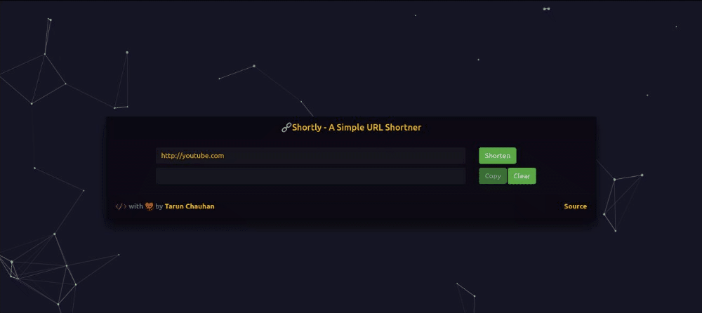

<h1 align="center">🔗 Shortly - A Simple URL Shortner </h1>

<div align="center">




</div>
> This is a URL Shortner built using MERN Stack.

### 🏠 [Homepage](http://url-shortly.herokuapp.com)


## Prerequisites

- npm >=5.5.0 

- node >=9.3.0

## 🛠 Local Development

### Install

<small> Install both client and server dependencies </small>

```bash

# Install dependencies for server
$ npm install

# Install dependencies for client
$ npm run client-install

```

### Configuration

<small> 1. Create a **nodemon.json** file in project root dir </small>

```bash

$ touch nodemon.json

```

<small> 2. Feed values to the file like this - </small>

```json

{
    "env": {

        "mongoURI": "",

        "baseUrl": "http://localhost:5000",

        "NODE_ENV": "development"
    }
}

```

:information_source: <small> To get the **mongoURI**, you can install MongoDB [locally](https://docs.mongodb.com/manual/installation/) , use [MongoDB Atlas](https://docs.atlas.mongodb.com/getting-started/) or simply use [MLab](https://mlab.com/).</small>

### Usage

```bash

# Run the client & server with concurrently
$ npm run dev

# Run the Express server only
$ npm run server

# Run the React client only
$ npm run client

# Server runs on http://localhost:5000 and client on http://localhost:3000

```

## 🚀 Production Deployment

There is a Heroku post build script so that you don't have to compile your React frontend manually, it is done on the server. Simply push to Heroku and it will build and load the client index.html page

